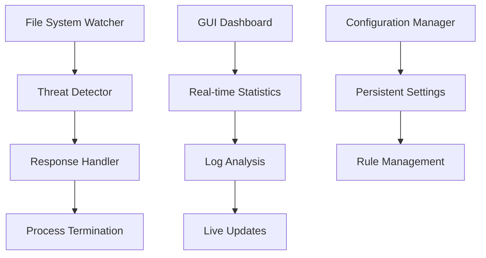

# Deadbolt 5 - Ransomware Protection System

## 🛡️ **Organized Project Structure**

DeadBolt 5 is a behavior-based ransomware detection and prevention system for Windows, now with a clean, organized project structure.

## 📁 **Project Organization**

```
deadbolt-5/
├── src/                     # Source code
│   ├── core/               # Core security components
│   │   ├── main.py         # System orchestrator
│   │   ├── detector.py     # Threat detection engine
│   │   ├── responder.py    # Response handler
│   │   ├── watcher.py      # File system monitor
│   │   └── DeadboltKiller.cpp # C++ process termination
│   ├── ui/                 # User interface
│   │   ├── main_gui.py     # Main GUI application
│   │   ├── dashboard.py    # Real-time dashboard
│   │   └── alerts.py       # Alert management
│   └── utils/              # Utility modules
│       ├── config.py       # Configuration constants
│       ├── config_manager.py # Config management
│       └── logger.py       # Logging utilities
├── tests/                   # Test suite
│   ├── unit/               # Unit tests
│   ├── integration/        # Integration tests
│   └── *.py               # Test scripts
├── scripts/                # Control scripts
│   ├── build.bat          # Build and setup
│   ├── start_defender.bat # Start system
│   ├── start_gui.bat      # Start GUI
│   └── stop_defender.bat  # Stop system
├── config/                 # Configuration files
│   └── deadbolt_config.json
├── logs/                   # Log files
├── bin/                    # Compiled binaries
│   └── DeadboltKiller.exe
├── docs/                   # Documentation
├── deadbolt.py            # Main entry point
├── requirements.txt       # Dependencies
└── README.md             # This file
```

## 🚀 **Quick Start**

### 1. Build and Setup
```bash
# Run the build script (as administrator)
scripts\build.bat
```

### 2. Start the System

#### GUI Mode (Recommended)
```bash
python deadbolt.py --gui
# OR
scripts\start_gui.bat
```

#### Daemon Mode (Background)
```bash
python deadbolt.py --daemon
# OR  
scripts\start_defender.bat
```

#### Interactive Mode
```bash
python deadbolt.py --interactive
```

## 📋 **System Requirements**

- **OS**: Windows 10/11
- **Python**: 3.7+
- **Privileges**: Administrator (recommended)
- **Dependencies**: See requirements.txt

## 🎯 **Core Features**

### 🔍 **Advanced Detection**
- Real-time file system monitoring
- Behavior-based threat detection
- Mass modification/deletion detection
- Suspicious file pattern recognition
- Zero-day ransomware protection

### ⚡ **Multi-Layer Response**
- Python primary response system
- C++ fallback termination engine
- Smart target identification
- False positive prevention
- Emergency response protocols

### 📊 **Live Dashboard**
- **Real-time statistics**: Threats detected, blocked, processes terminated
- **System health monitoring**: All components status
- **Recent activity tracking**: Threats and responses with timestamps
- **Interactive configuration**: Paths, rules, and actions
- **Live log monitoring**: Filtering and search capabilities

### 🛠️ **Configuration Management**
- Persistent settings storage
- Directory path management
- Detection rule customization
- Response action configuration

## 📈 **Dashboard Statistics**

The GUI now displays **actual data from log files**:

- **📊 Total Events**: Real count from system logs
- **🎯 Threats Detected**: Actual threats identified
- **🛡️ Threats Blocked**: Real blocked attempts
- **⚡ Processes Terminated**: Actual termination count
- **🚨 Alert Distribution**: High/Medium/Low severity breakdown
- **💾 System Health**: Live component status monitoring

## 🔧 **Project Benefits**

### 📁 **Organized Structure**
- Clear separation of concerns
- Modular architecture
- Easy maintenance and testing
- Professional codebase organization

### 🔄 **Import Management**
- Proper Python package structure
- Relative imports for better dependency management
- Clean module interfaces
- Reduced import conflicts

### 🛠️ **Development Workflow**
- Dedicated test directory structure
- Build and deployment scripts
- Configuration management
- Documentation organization

### 📦 **Deployment Ready**
- Single entry point (deadbolt.py)
- Requirements management
- Binary organization
- Configuration externalization

## ⚙️ **Configuration**

### Monitored Directories
Edit `config/deadbolt_config.json`:
```json
{
  "target_dirs": [
    "C:\\Users\\MADHURIMA\\Documents",
    "C:\\Users\\MADHURIMA\\Desktop"
  ]
}
```

### Detection Rules
```json
{
  "rules": {
    "mass_delete": {"count": 10, "interval": 5},
    "mass_rename": {"count": 10, "interval": 5}
  }
}
```

### Response Actions
```json
{
  "actions": {
    "kill_process": true,
    "dry_run": false,
    "log_only": false
  }
}
```

## 🧪 **Testing**

```bash
# Run integration tests
python tests/test_gui_integration.py

# Run statistics validation
python tests/test_gui_statistics.py

# Run system validation
python tests/final_validation.py
```

## 📝 **Log Files**

The system generates comprehensive logs:

- `logs/main.log` - System orchestration events
- `logs/detector.log` - Threat detection analysis (4.15 MB)
- `logs/responder.log` - Response actions taken (2.69 MB)  
- `logs/watcher.log` - File system monitoring (2.62 MB)
- `logs/deadbolt.log` - General application events

## 🏗️ **Architecture**



## 🔐 **Security Features**

- **Safe Process Filtering**: Avoids system processes
- **Configurable Thresholds**: Adjustable detection sensitivity
- **Notification Cooldown**: Prevents alert spam
- **Comprehensive Logging**: Complete audit trail
- **Multi-layer Fallback**: Multiple termination methods

## 📞 **Support**

- **Documentation**: Check `docs/` directory
- **Examples**: See `examples/` directory
- **Issues**: Review log files in `logs/`
- **Configuration**: Modify `config/deadbolt_config.json`

## 🎉 **What's New in Organized Structure**

1. **📁 Clean Module Organization**: Proper separation of core, UI, and utilities
2. **📊 Real Statistics Display**: GUI shows actual data from log analysis  
3. **🔄 Better Import Management**: Relative imports and proper package structure
4. **🛠️ Enhanced Build System**: Automated setup and compilation scripts
5. **📝 Comprehensive Documentation**: Clear project structure and usage guides
6. **🧪 Organized Testing**: Dedicated test directories and validation scripts
7. **⚙️ Configuration Management**: Externalized settings with persistence
8. **📦 Deployment Ready**: Single entry point and clean binary organization

---

**Ready to launch**: `python deadbolt.py --gui` 🚀